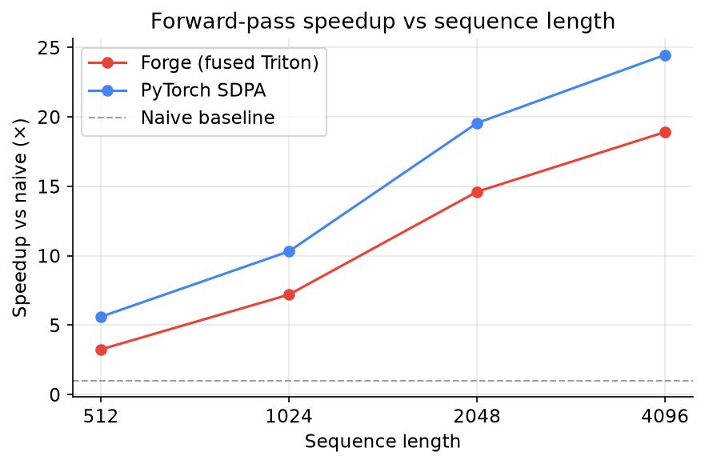
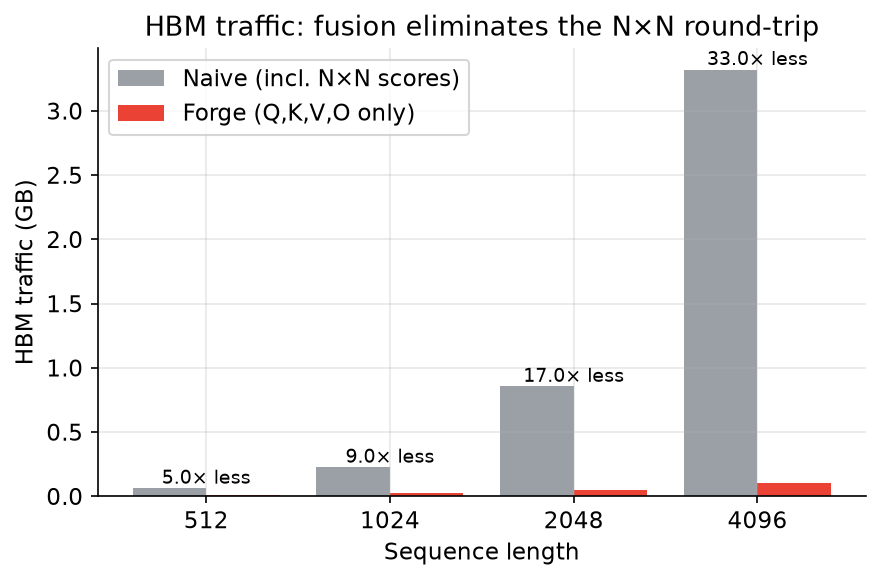
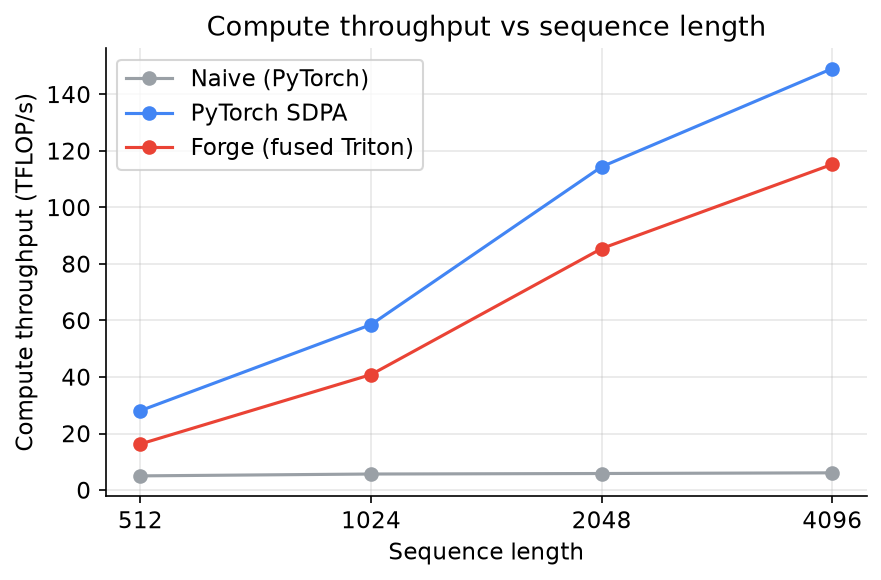
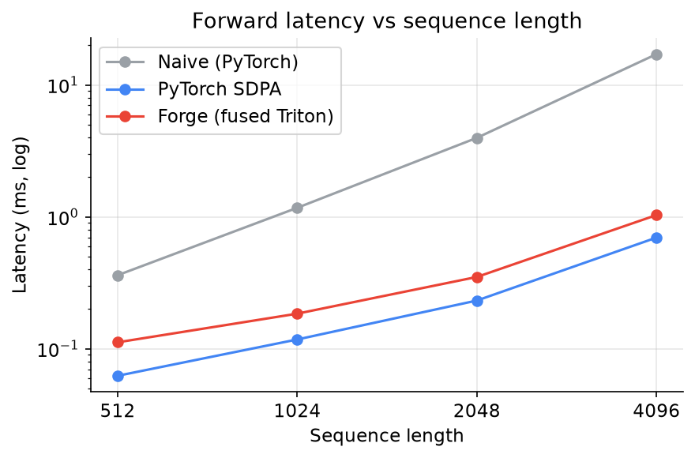
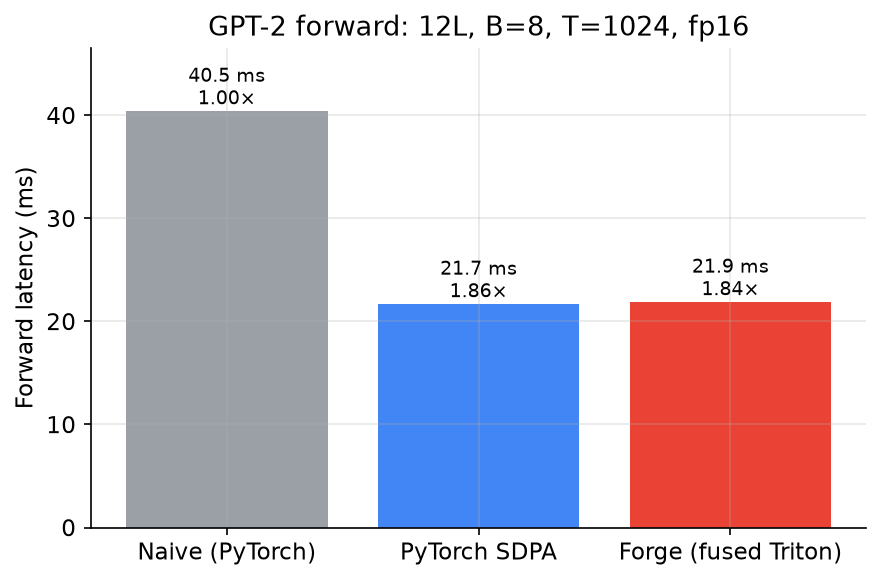

# Benchmarks

All numbers measured on a single **NVIDIA A100-SXM4-40GB** (Modal), fp16, causal
attention, GPT-2-small head geometry (`heads=12`, `head_dim=64`). Latency is the
median over 30 timed iterations (10 warmup) using CUDA events. Reproduce with:

```bash
modal run modal_app.py::bench          # sweep -> benchmarks/results.csv + docs/assets/*.png
```

Three implementations are compared:

- **Naive (PyTorch)** — textbook unfused attention that materializes the N×N
  score matrix in HBM. The baseline.
- **Forge (fused Triton)** — our kernel (`forge/flash_attn.py`).
- **PyTorch SDPA** — `scaled_dot_product_attention`, NVIDIA's production
  FlashAttention-2 in hand-tuned CUDA. The performance ceiling to chase.

## Headline: speedup vs sequence length



| Seqlen | Naive | **Forge (fused, tuned)** | PyTorch SDPA |
|-------:|------:|-------------------------:|-------------:|
|    512 | 1.00× |                **3.25×** |        5.61× |
|   1024 | 1.00× |                **7.20×** |       10.32× |
|   2048 | 1.00× |               **14.61×** |       19.56× |
|   4096 | 1.00× |               **18.91×** |       24.47× |

Forge is up to **18.9× faster than the naive baseline**, and the gap widens with
sequence length — exactly as the memory-traffic argument predicts. After the
[Phase-4 tuning loop](profiling.md) (pipeline depth + two-phase causal loop),
Forge sits within **~1.3×** of PyTorch SDPA's hand-tuned CUDA (down from ~1.5×).

## Why: HBM traffic



The naive path's HBM traffic is dominated by writing and re-reading the N×N score
matrix, so it grows as O(N²). Forge keeps the scores in SRAM and moves only
Q, K, V, O — O(N) traffic. At N=4096 that is **3.32 GB vs 0.10 GB — ~33× less**.
This is the root cause of both the speedup and the higher compute throughput.

## Compute throughput



The naive kernel is memory-bandwidth bound and plateaus around **6 TFLOP/s**.
Freed from the N×N round-trip, Forge reaches **~115 TFLOP/s** at N=4096 (SDPA:
~149). On a 312 TFLOP/s-peak A100, that is the difference between a
bandwidth-bound and a compute-bound kernel.

## Latency



Absolute forward latency (log scale). Naive grows steeply (O(N²) work *and*
traffic); Forge and SDPA stay an order of magnitude below it.

## Batch-size sweep (N=1024)

Speedup vs naive is stable across batch sizes, confirming the win is structural
(traffic reduction) rather than an artifact of one shape:

| Batch | **Forge** | SDPA |
|------:|----------:|-----:|
|     1 |     3.42× | 5.85× |
|     2 |     5.29× | 9.08× |
|     4 |     7.37× | 11.03× |
|     8 |     9.81× | 13.41× |

Raw data: [`benchmarks/results.csv`](../benchmarks/results.csv).

## End-to-end GPT-2 forward

The kernel numbers above isolate attention. This measures the whole model: one
GPT-2 (12 layers, 12 heads, d=768, fp16) run with each attention backend swapped
in — everything else identical. B=8, T=1024.



| Backend | Forward latency | Speedup vs naive |
|---------|----------------:|-----------------:|
| Naive (PyTorch) | 40.5 ms | 1.00× |
| PyTorch SDPA | 21.7 ms | 1.86× |
| **Forge (fused)** | **21.9 ms** | **1.85×** |

Swapping Forge's fused kernel into GPT-2 delivers a **1.85× end-to-end forward
speedup** over the naive baseline and **matches PyTorch SDPA to within 1%** — at
the full-model level, attention shares the runtime with the MLP, LayerNorms, and
projections, so the small kernel-level gap to SDPA washes out. The fused path's
logits differ from SDPA by at most **2.9e-3** (max abs), confirming the swap is
numerically safe. Reproduce with `modal run modal_app.py::e2e`.
