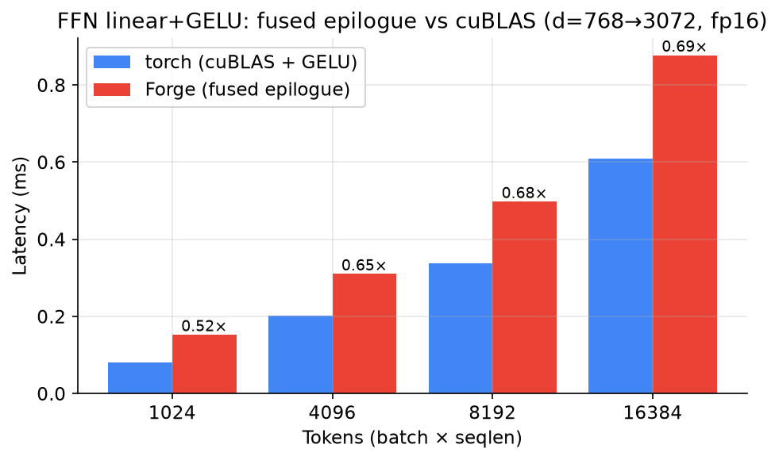

# MLP / GELU fusion

GPT-2's feed-forward block is `c_proj(gelu(c_fc(x)))`. The `c_fc` matmul produces
a 4×d-wide intermediate that the activation then reads back from HBM and rewrites.
`forge/mlp.py` fuses the **GELU into the `c_fc` matmul epilogue**: a tiled Triton
GEMM activates each output tile in registers and writes it once, so the
pre-activation never round-trips through HBM.

The kernel is a standard L2-grouped GEMM (128×128 tiles, `GROUP_M=8`, 4-stage
pipeline) with a tanh-GELU epilogue. Forward is fused; backward recomputes via
PyTorch autograd (a clean seam for a fused backward GEMM), so this is an
**inference-forward** optimization.

## Result: honest, and a useful lesson

Fused `c_fc + GELU` vs PyTorch's `F.gelu(F.linear(x), 'tanh')` (cuBLAS matmul +
its own fused GELU), d=768→3072, fp16:

| Tokens | torch (cuBLAS) | Forge (fused) | Speedup |
|-------:|---------------:|--------------:|--------:|
|   1024 |        0.09 ms |       0.15 ms |   0.52× |
|   4096 |        0.20 ms |       0.31 ms |   0.65× |
|   8192 |        0.34 ms |       0.50 ms |   0.68× |
|  16384 |        0.61 ms |       0.88 ms |   0.69× |

**The fused kernel is ~0.7× — i.e. slower — than cuBLAS.** This is the honest and
instructive result: the epilogue fusion does remove the intermediate-activation
HBM round-trip (~0.2 GB at 16k tokens), but for a compute-bound GEMM the matmul
dominates, and a hand-written Triton GEMM does not match **cuBLAS**, which has
years of vendor tuning (tensor-core scheduling, split-K, custom tiling).

### Why this contrasts with the attention result

Attention fusion won big (up to 18.9×) because the naive baseline was
**memory-bandwidth bound** — the N×N HBM round-trip *was* the cost, so removing it
was pure profit. The FFN is **compute bound**: the activation round-trip is a small
fraction of the runtime, so fusing it can't overcome losing the matmul itself to
cuBLAS. Kernel fusion pays off exactly when memory traffic — not the matmul — is
the bottleneck.

### Takeaway

The right call in production is to **fuse only the activation epilogue onto a
cuBLAS/CUTLASS GEMM** (e.g. via `torch.compile` / a CUTLASS epilogue), not to
reimplement the GEMM in Triton. Forge's version is correct (verified vs torch to
2e-2) and demonstrates the technique, but the benchmark quantifies why beating a
vendor GEMM from scratch is a losing game — a result worth knowing.
